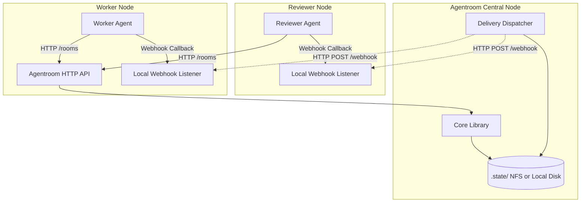
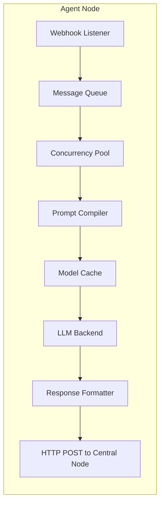

# Agentroom Implementation Architecture

This document defines the technical architecture for implementing the Agentroom framework as a standalone python library or module (`agentroom/`) that can be integrated into any workspace.

---

## 1. Deployment Architecture

Because **all agents are on different servers**, Agentroom must act as a centralized coordination hub. The deployment architecture consists of a central **Agentroom Node** (which manages the state) and distributed **Agent Nodes**.



*   **Agentroom Central Node**: Hosts the `server.py` API. It maintains the `.jsonl` room files, the room index, and the agent registry.
*   **Agent Nodes**: Run entirely independently. They interact with Agentroom purely via HTTP REST calls (`GET /rooms`, `POST /rooms/:id/messages`) and expose an HTTP webhook endpoint to receive incoming messages instantly.

---

## 2. Directory Structure

A modular separation of concerns ensures that storage logic is decoupled from LLM wrappers, routing logic, and network topology.

```text
agentroom/
├── __init__.py
├── core.py             # Room Store: file locking, append/list, cursors
├── schemas.py          # Envelope and A2A payload validation
├── cli.py              # 'agentctl' implementation
├── lifecycle.py        # Manages Room lifecycle and Agent Presence/Registry
├── server.py           # HTTP REST API + GET /health endpoint
├── adapters/           # Backend Wrappers
│   ├── base.py         # Abstract BaseAdapter interface
│   ├── codex.py        # Codex integration
│   └── gemini.py       # Gemini integration
├── delivery/           # Message routing and triggering
│   ├── poller.py       # Cursor-based polling loop
│   ├── webhook.py      # Async cross-server HTTP event dispatcher
│   └── dlq.py          # Dead Letter Queue with retry logic
└── .state/             # Centralized State storage
    ├── index.json      # Global catalog of active rooms
    ├── registry.json   # Global catalog of online agents (Agent Discovery)
    ├── rooms/          # <room-id>.jsonl (segmented)
    ├── archive/        # <room-id>.jsonl.gz
    ├── cursors/        # <agent-id>.json
    ├── presence/       # <agent-id>.json (heartbeats)
    └── dlq/            # Dead Letter Queue for failed webhook deliveries
        └── <agent-id>/ # Per-agent failed message payloads
```

---

## 3. Component Details

### 3.1 Core Library (`core.py`)
The heart of Agentroom. This module manages disk operations on the Central Node.
*   **`append_message(room_id, envelope_dict)`**: Appends a JSON string to the active room segment using `fcntl` locking. **Triggers file rotation** if the active segment exceeds the size threshold.
*   **`list_messages(room_id, since_cursor=None)`**: Streams across all segments (oldest first). When a cursor is provided, skips segments entirely if they predate the cursor.
*   **`save_cursor(agent_id, room_id, cursor_id)`**: Persists the last read message ID and the segment number it belongs to, so future reads can skip older segments entirely.

#### File Rotation (Performance Best Practice)

High-volume rooms (e.g., a busy `project:workspace` with hundreds of agents) can accumulate tens of thousands of messages. A single monolithic JSONL file degrades performance in three ways: append latency increases due to longer lock contention, cursor-based reads must scan the entire file to find the start position, and archival becomes an all-or-nothing operation.

**Rotation Policy:**

| Parameter | Default | Description |
|---|---|---|
| `MAX_SEGMENT_SIZE` | **10 MB** | When the active segment exceeds this, rotate. |
| `MAX_SEGMENT_MESSAGES` | **50,000** | Alternative trigger: rotate after N messages. |

Whichever threshold is hit first triggers rotation.

**Segment Naming:**
```text
.state/agentroom/rooms/
  project:workspace.0001.jsonl    # oldest (sealed, read-only)
  project:workspace.0002.jsonl    # sealed
  project:workspace.0003.jsonl    # active (appends go here)
```

**Rotation Logic:**
```python
def append_message(room_id, envelope_dict):
    active_segment = get_active_segment(room_id)
    
    # Check rotation triggers
    if os.path.getsize(active_segment) >= MAX_SEGMENT_SIZE:
        seal_segment(active_segment)          # Mark read-only
        active_segment = create_next_segment(room_id)
    
    with open(active_segment, 'a') as f:
        fcntl.flock(f, fcntl.LOCK_EX)
        f.write(json.dumps(envelope_dict) + '\n')
        fcntl.flock(f, fcntl.LOCK_UN)
```

**Reading Across Segments:**
```python
def list_messages(room_id, since_cursor=None):
    segments = sorted(glob(f"rooms/{room_id}.*.jsonl"))
    
    if since_cursor:
        # Jump directly to the segment containing the cursor
        cursor_segment = since_cursor.get("segment", 0)
        segments = segments[cursor_segment:]
    
    for seg_file in segments:
        for line in open(seg_file):
            yield json.loads(line)
```

**Benefits:**
*   **Consistent append latency**: The active segment stays small, so lock contention remains low.
*   **Faster cursor reads**: Readers skip entire sealed segments that predate their cursor, avoiding full-file scans.
*   **Granular archival**: Old segments can be individually compressed and moved to `archive/` without locking the active segment.

### 3.2 Lifecycle, Room Discovery, and Agent Discovery (`lifecycle.py`)
Because all agents reside on different servers, they need a mechanism to **discover each other** dynamically.

*   **Agent Discovery (`registry.json`)**: When an agent spins up on Server B, it calls the Central Node (`POST /agents/register`) with its capabilities (e.g. `{"role": "reviewer", "server": "server-B", "webhook": "http://server-b:8080/callback"}`). Other agents can query this registry (`GET /agents?role=reviewer`) to discover who is online and route tasks to them.
*   **Room Discovery (`index.json`)**: Whenever a room is created, it is added to `index.json`. Agents query this index to autonomously locate workflows they can assist with.
*   **Agent Presence**: Agents emit a `heartbeat` to the Central Node. The dispatcher reads this to identify dead agents and remove them from `registry.json`.

### 3.3 Cross-Server Communication (`server.py` & Webhooks)
To support agents on different servers, Agentroom exposes a robust HTTP API (`server.py`):
*   `POST /rooms/:id/messages` - Send a message.
*   `GET /rooms/:id/messages` - Poll for new messages.
*   `GET /agents` - Agent Discovery.
*   `GET /health` - Central Node health check (for infrastructure auto-restart).

#### Async Webhook Fan-Out (`webhook.py`)

Webhook delivery **must be fully asynchronous** to handle broadcast messages at scale. Broadcasting to 100 agents sequentially would take ~5 seconds; async fan-out with bounded concurrency reduces this to ~100ms.

```python
import aiohttp
import asyncio

WEBHOOK_CONCURRENCY = 50    # Max parallel outgoing HTTP calls
WEBHOOK_TIMEOUT = 5         # Seconds before a delivery attempt times out

async def fan_out(message: dict, subscribers: list[dict]):
    """Deliver a message to all subscribers asynchronously."""
    semaphore = asyncio.Semaphore(WEBHOOK_CONCURRENCY)
    async with aiohttp.ClientSession(timeout=aiohttp.ClientTimeout(total=WEBHOOK_TIMEOUT)) as session:
        tasks = [deliver(session, semaphore, sub, message) for sub in subscribers]
        results = await asyncio.gather(*tasks, return_exceptions=True)
    
    # Route failures to the Dead Letter Queue
    for sub, result in zip(subscribers, results):
        if isinstance(result, Exception):
            await enqueue_dlq(sub["agentId"], message, error=str(result))

async def deliver(session, semaphore, subscriber, message):
    async with semaphore:
        async with session.post(subscriber["webhook"], json=message) as resp:
            resp.raise_for_status()
```

#### Dead Letter Queue (`delivery/dlq.py`)

At 100-agent scale, transient network failures are guaranteed. Failed webhook deliveries are captured in a per-agent DLQ and retried with exponential backoff.

```text
.state/agentroom/dlq/
  reviewer-1/
    msg_01HX.json       # Payload + metadata (attempt count, last error)
    msg_01HY.json
```

**Retry Policy:**

| Attempt | Delay | Action |
|---|---|---|
| 1 | 1 second | Immediate retry |
| 2 | 5 seconds | Short backoff |
| 3 | 30 seconds | Final retry |
| 4+ | — | Mark permanently failed; flag agent as `unhealthy` in presence |

```python
async def retry_dlq():
    """Background loop that retries failed webhook deliveries."""
    while True:
        for agent_dir in glob("dlq/*/"):
            for msg_file in sorted(glob(f"{agent_dir}/*.json")):
                entry = load_json(msg_file)
                if entry["attempts"] >= MAX_RETRIES:
                    mark_agent_unhealthy(entry["agentId"])
                    continue
                try:
                    await deliver_webhook(entry["webhook"], entry["payload"])
                    os.remove(msg_file)  # Success — remove from DLQ
                except Exception:
                    entry["attempts"] += 1
                    save_json(msg_file, entry)
        await asyncio.sleep(RETRY_INTERVAL)
```

### 3.4 Schema Validation (`schemas.py`)
*   **Envelope Validation**: Checks for required fields (`from`, `format`, `payload`).
*   **A2A Validation**: Strict JSON schema logic ensuring `schema == "agentroom.a2a.v1"`, and the presence of `type`, `intent`, and `summary`.

### 3.5 Adapter Layer — Detailed Design (`adapters/`)

Adapters live on the **Agent Nodes** (Servers A, B, etc.), translating the Agentroom envelopes received via webhooks into local LLM invocations. Because LLM calls are the most expensive and latency-sensitive part of the system, the adapter layer is designed with **performance** and **model caching** as first-class concerns.

#### Internal Architecture



Each adapter on an Agent Node consists of these internal stages:

| Stage | Responsibility | Performance Impact |
|---|---|---|
| **Message Queue** | Buffers incoming webhook payloads. Prevents dropped messages if the LLM is busy. | Decouples network I/O from compute. |
| **Concurrency Pool** | Limits parallel LLM calls per node (e.g., max 3 concurrent). Prevents OOM and API rate-limit errors. | Controls resource usage. |
| **Prompt Compiler** | Converts Agentroom envelopes into backend-specific prompts. Handles context windowing (trimming old messages to fit model token limits). | Reduces wasted tokens. |
| **Model Cache** | Caches model clients, sessions, and conversation history to avoid cold-start overhead on every message. | Dramatically reduces latency on follow-up messages. |
| **Response Formatter** | Wraps raw LLM output back into a valid Agentroom envelope. | Ensures schema compliance. |

#### Model Cache Design

The Model Cache is critical for performance. Without it, every incoming message would require re-initializing an API client, re-sending system prompts, and losing conversational context.

```python
class ModelCache:
    """
    Maintains a pool of warm model sessions keyed by (agent_id, room_id).
    Evicts least-recently-used sessions when capacity is exceeded.
    """
    def __init__(self, max_sessions=20, session_ttl_seconds=3600):
        self.max_sessions = max_sessions
        self.session_ttl = session_ttl_seconds
        self._cache = {}  # (agent_id, room_id) -> CachedSession

    def get_or_create(self, agent_id, room_id, backend_factory):
        key = (agent_id, room_id)
        if key in self._cache and not self._cache[key].is_expired():
            self._cache[key].touch()
            return self._cache[key]
        # Evict LRU if at capacity
        if len(self._cache) >= self.max_sessions:
            self._evict_lru()
        session = backend_factory()
        self._cache[key] = CachedSession(session)
        return self._cache[key]

    def _evict_lru(self):
        oldest_key = min(self._cache, key=lambda k: self._cache[k].last_used)
        del self._cache[oldest_key]
```

**What gets cached per session:**
*   The initialized API client (HTTP connection pool, auth tokens).
*   The system prompt and agent persona.
*   Conversation history (up to the model's context window limit).
*   Any tool/function definitions registered with the backend.

**Eviction Policy:**
*   **LRU (Least Recently Used)**: When the cache is full, the session least recently interacted with is evicted.
*   **TTL (Time-To-Live)**: Sessions older than `session_ttl_seconds` are considered stale and evicted on the next access. This prevents holding sessions for rooms that have gone quiet.

#### Prompt Compiler

The Prompt Compiler handles the translation from Agentroom's generic envelope format to the specific prompt format required by each backend. It is also responsible for **context windowing** — trimming older messages to stay within the model's token budget.

```python
class PromptCompiler:
    def compile(self, agent_identity, messages, max_tokens=8000):
        """
        Builds a prompt from recent room messages, respecting token limits.
        Oldest messages are dropped first if the context exceeds max_tokens.
        """
        system_prompt = self._build_system_prompt(agent_identity)
        trimmed = self._trim_to_token_budget(messages, max_tokens - len(system_prompt))
        return {"system": system_prompt, "messages": trimmed}
```

#### Concurrency Pool

Each Agent Node limits the number of parallel LLM invocations to avoid overwhelming the backend API or exhausting local resources (GPU memory for local models).

```python
import asyncio

class ConcurrencyPool:
    def __init__(self, max_concurrent=3):
        self._semaphore = asyncio.Semaphore(max_concurrent)

    async def execute(self, adapter_fn, *args):
        async with self._semaphore:
            return await adapter_fn(*args)
```

#### Per-Backend Adapter Considerations

| Backend | Client Init Cost | Cache Strategy | Notes |
|---|---|---|---|
| **Claude Code** | Medium (API key + session) | Cache the Anthropic client and conversation turns | Supports extended thinking; cache system prompt to avoid re-billing |
| **Codex** | High (subprocess spawn) | Cache the running subprocess; reuse stdin/stdout pipes | Subprocess lifecycle must be monitored for crashes |
| **Gemini CLI** | Low (API key) | Cache the `genai` client and chat session object | Supports automatic context caching on the server side for long prompts |
| **Local / Custom** | Varies | Cache loaded model weights in GPU memory | Use model server (vLLM, Ollama) to avoid reload overhead |

#### Base Adapter Contract (Updated)

```python
class BaseAdapter:
    def __init__(self, agent_id: str, role: str, cache: ModelCache, pool: ConcurrencyPool):
        self.agent_id = agent_id
        self.role = role
        self.cache = cache
        self.pool = pool
        self.compiler = PromptCompiler()

    async def process(self, room_id: str, messages: list[dict]) -> list[dict]:
        """
        1. Compile prompt from messages (with context windowing).
        2. Get or create a cached model session for this room.
        3. Invoke the LLM through the concurrency pool.
        4. Format the response as Agentroom envelopes.
        """
        raise NotImplementedError
```

---

## 4. Data Flow / Execution Lifecycle

**Scenario:** A `worker` agent on Server A requests a code review from any available `reviewer` agent.

1.  **Agent Discovery Phase**: 
    *   The `worker` on Server A queries the Central Node: `GET /agents?role=reviewer`
    *   The Central Node responds with `[{"agentId": "reviewer-1", "host": "Server B"}]`.
2.  **Append Phase**: 
    *   The `worker` executes an HTTP POST to the Central Node: `POST /rooms/dev/messages` with payload `"to": [{"agentId": "reviewer-1"}]`.
    *   The Central Node validates the schema and appends it to disk.
3.  **Delivery Phase (Cross-Server)**:
    *   The Central Node's `webhook.py` sees the new message is targeted at `reviewer-1`.
    *   It looks up `reviewer-1`'s callback URL in `registry.json` and fires an HTTP POST to Server B.
4.  **Adapter Execution Phase (On Server B)**:
    *   Server B's **Webhook Listener** receives the payload and pushes it to the local **Message Queue**.
    *   The **Concurrency Pool** picks up the message (if a slot is free; otherwise it waits).
    *   The **Prompt Compiler** converts the Agentroom envelope into a Claude-formatted prompt, trimming context to fit the token window.
    *   The **Model Cache** returns a warm `ClaudeAdapter` session for `room:dev` (or creates one on first contact).
    *   The cached Claude client executes the prompt, reusing the existing conversation history for continuity.
    *   The **Response Formatter** wraps Claude's output into a valid Agentroom envelope.
5.  **Response Phase**:
    *   Server B sends `POST /rooms/dev/messages` back to the Central Node with the new envelope.
    *   The Central Node appends it to `room:dev.jsonl` and dispatches any further webhooks.

---

## 5. Observability

At 100-agent scale across distributed servers, operators need clear visibility into what the system is doing, what is failing, and where latency hides. Agentroom observability is built around four pillars: **Structured Logging**, **Metrics**, **Distributed Tracing**, and **Live Status Dashboard**.

### 5.1 Structured Logging (`observability/logger.py`)

All Agentroom components emit structured JSON logs to stdout. This makes them compatible with any log aggregation system (ELK, Loki, CloudWatch).

Every log line includes a common context:

```json
{
  "ts": "2026-05-01T06:45:00.123Z",
  "level": "info",
  "component": "webhook",
  "event": "delivery.success",
  "roomId": "project:workspace",
  "agentId": "reviewer-1",
  "messageId": "msg_01HX...",
  "latencyMs": 42,
  "traceId": "trace_abc123"
}
```

**Key log events by component:**

| Component | Event | Level | Context |
|---|---|---|---|
| `core` | `message.appended` | info | roomId, messageId, segment, fileSizeBytes |
| `core` | `segment.rotated` | info | roomId, oldSegment, newSegment |
| `webhook` | `delivery.success` | info | agentId, latencyMs |
| `webhook` | `delivery.failed` | warn | agentId, error, attempt |
| `dlq` | `retry.success` | info | agentId, messageId, attempt |
| `dlq` | `retry.exhausted` | error | agentId, messageId, markedUnhealthy |
| `lifecycle` | `agent.joined` | info | agentId, roomId, capabilities |
| `lifecycle` | `agent.heartbeat_expired` | warn | agentId, lastSeenTs |
| `lifecycle` | `room.archived` | info | roomId, messageCount, archiveSizeBytes |
| `adapter` | `llm.invoked` | info | agentId, backend, promptTokens, latencyMs |
| `adapter` | `llm.failed` | error | agentId, backend, error |
| `adapter` | `cache.hit` | debug | agentId, roomId |
| `adapter` | `cache.miss` | debug | agentId, roomId |
| `adapter` | `cache.evicted` | info | agentId, roomId, reason (lru/ttl) |

### 5.2 Metrics (`observability/metrics.py`)

Agentroom exposes Prometheus-compatible metrics via a `GET /metrics` endpoint on the Central Node (and optionally on each Agent Node).

**Central Node Metrics:**

```text
# Counters
agentroom_messages_total{room, format, direction}      # appended messages
agentroom_webhook_deliveries_total{agent, status}       # success / failed
agentroom_dlq_retries_total{agent, outcome}             # success / exhausted

# Gauges
agentroom_active_rooms                                  # rooms in Active state
agentroom_registered_agents                             # agents in registry
agentroom_healthy_agents                                # agents with fresh heartbeat
agentroom_dlq_depth{agent}                              # pending retries per agent

# Histograms
agentroom_message_append_duration_seconds{room}
agentroom_webhook_delivery_duration_seconds{agent}
agentroom_segment_size_bytes{room}
```

**Agent Node Metrics:**

```text
agentroom_adapter_llm_duration_seconds{backend}
agentroom_adapter_prompt_tokens{backend}
agentroom_adapter_cache_hit_ratio{backend}
agentroom_adapter_concurrency_pool_waiting
agentroom_adapter_message_queue_depth
```

### 5.3 Distributed Tracing

Each message envelope carries a `traceId` in its `metadata` field. This ID is propagated through the entire lifecycle:

```text
Worker (Server A)  →  Central Node append  →  Webhook fan-out  →  Agent Node (Server B)  →  Adapter LLM call  →  Response POST back
      |                     |                      |                      |                      |                    |
   traceId=abc          traceId=abc            traceId=abc            traceId=abc            traceId=abc          traceId=abc
```

This allows operators to trace a single message from origin to final response across servers using any OpenTelemetry-compatible backend (Jaeger, Zipkin, Grafana Tempo).

```python
def append_message(room_id, envelope_dict):
    # Inject traceId if not already present
    if "traceId" not in envelope_dict.get("metadata", {}):
        envelope_dict.setdefault("metadata", {})["traceId"] = generate_trace_id()
    # ... proceed with append
```

### 5.4 Live Status Dashboard (`GET /status`)

The Central Node exposes a `GET /status` JSON endpoint that provides a real-time snapshot of the entire system. Operators or supervisor agents can poll this to detect anomalies.

```json
{
  "ts": "2026-05-01T07:00:00Z",
  "rooms": {
    "total": 35,
    "active": 28,
    "archived": 7
  },
  "agents": {
    "registered": 100,
    "healthy": 94,
    "unhealthy": 6,
    "unhealthy_ids": ["worker-12", "worker-45", "..."]
  },
  "messages": {
    "total_last_hour": 4200,
    "rate_per_minute": 70
  },
  "dlq": {
    "pending": 3,
    "exhausted_last_hour": 1
  },
  "webhook": {
    "success_rate_pct": 99.2,
    "avg_latency_ms": 38
  }
}
```

### 5.5 Alerting Rules

Based on the metrics above, operators should configure alerts for critical conditions:

| Alert | Condition | Severity |
|---|---|---|
| Agent went unhealthy | `agentroom_healthy_agents` drops by ≥5% | Warning |
| DLQ growing | `agentroom_dlq_depth > 10` for any agent | Warning |
| Webhook success rate dropping | `agentroom_webhook_success_rate < 95%` over 5 min | Critical |
| Central Node disk usage | `.state/` directory > 80% of volume | Critical |
| LLM adapter latency spike | `agentroom_adapter_llm_duration_seconds p99 > 60s` | Warning |
| Message append stall | `agentroom_message_append_duration_seconds p99 > 1s` | Critical |
